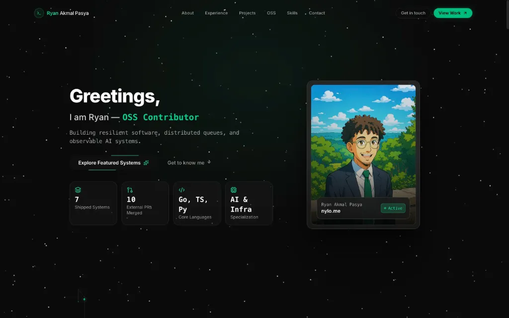

<div align="center">

# ⚡ nylo.me

**Minimalist, High-Performance Systems Engineer Portfolio & Interactive Web Experience**

[](https://nylo.me)
[](https://react.dev)
[](https://vitejs.dev)
[](https://tailwindcss.com)
[](https://www.framer.com/motion/)

<br /><br />

<a href="https://nylo.me" target="_blank">
  
</a>

<br /><br />

[Live Showcase](https://nylo.me) · [Report Bug](https://github.com/Ryanakml/nylo.me/issues) · [Request Feature](https://github.com/Ryanakml/nylo.me/issues)

</div>

---

## 🌟 Overview

**nylo.me** is a custom, engineering-first personal portfolio engineered for high visual fidelity, buttery 60fps scroll transitions, and zero bloat. Built from the ground up to showcase distributed systems, autonomous AI agents, backend architectures, and upstream open-source contributions.

### ✨ Key Features

- **Liquid Scroll Navbar**: Continuous 0px–150px physical spring interpolation (`useScroll` + `useSpring` + `useTransform`). Transforms seamlessly from a transparent full-width top bar into a floating, smoked-glass capsule without abrupt boolean toggles.
- **Minimalist Hero Section**: Single-line role cycler (`TextLoop`) with staggered initial delay to prevent simultaneous transitions, integrated with an interactive 3D Comet Card.
- **macOS Dev Terminal**: Interactive, authentic terminal experience featuring `fastfetch` hardware & software specifications, live uptime ticker, manifesto tab, and interactive zsh command shell.
- **Open Source Contributions Showcase**: Curated upstream merged pull requests to world-class software runtimes and tools (OpenHands, Celery, Matplotlib, Pylint, Typeshed) with Aceternity expandable modal deep-dives.
- **5x1 Canvas Matrix Skills**: High-density bento stack with Aceternity `CanvasRevealEffect` matrix particle simulations and architectural tooltips on hover.
- **3D Card Perspective Projects**: Hardware-accelerated 3D hover tilt showcases featuring real-world distributed architectures, idempotent webhooks, and AI pipelines.
- **Dashed Timeline Experience**: 1:1 timeline visualization with pulsing Emerald nodes and dual-direction end caps.

---

## 🛠️ Tech Stack

- **Core**: [React 19](https://react.dev/), [Vite 6](https://vitejs.dev/)
- **Styling**: [Tailwind CSS v4](https://tailwindcss.com/)
- **Animation**: [Motion / Framer Motion](https://www.framer.com/motion/), [GSAP](https://gsap.com/)
- **3D & Canvas**: [Three.js](https://threejs.org/), [@react-three/fiber](https://docs.pmnd.rs/react-three-fiber), [@react-three/drei](https://github.com/pmndrs/drei)
- **Icons**: [Lucide React](https://lucide.dev/), [Tabler Icons](https://tabler-icons.io/)
- **Deployment**: [Vercel](https://vercel.com/)

---

## 🚀 Getting Started

### Prerequisites

- **Node.js** >= 18.0.0
- **npm** or **pnpm** or **bun**

### Installation

1. **Clone the repository:**
   ```bash
   git clone https://github.com/Ryanakml/nylo.me.git
   cd nylo.me
   ```

2. **Install dependencies:**
   ```bash
   npm install
   ```

3. **Start the local development server:**
   ```bash
   npm run dev
   ```

4. **Build for production:**
   ```bash
   npm run build
   ```

5. **Preview the production bundle:**
   ```bash
   npm run preview
   ```

---

## 📂 Project Architecture

```
nylo.me/
├── public/                 # Static assets, fonts, icons, media
├── src/
│   ├── components/         # Page sections
│   │   ├── Hero.jsx        # Minimalist hero & Comet card
│   │   ├── About.jsx       # Terminal with specs, manifesto, and shell
│   │   ├── Experience.jsx  # Dashed timeline experience
│   │   ├── OpenSource.jsx  # Merged upstream PRs & expandable cards
│   │   ├── Projects.jsx    # 3D tilt perspective project cards
│   │   ├── Skills.jsx      # 5x1 Canvas reveal matrix stack
│   │   ├── Contact.jsx     # Terminal contact & social links
│   │   └── Navbar.jsx      # Responsive navigation wrapper
│   ├── components/ui/      # Atomic UI primitives & animations
│   │   ├── resizable-navbar.jsx  # Liquid scroll-interpolated navbar
│   │   ├── terminal.jsx          # Interactive macOS terminal
│   │   ├── text-loop.jsx         # Fluid rotating text
│   │   ├── canvas-reveal-effect.jsx # Matrix canvas effect
│   │   └── comet-card.jsx        # 3D interactive hero badge
│   ├── constants/          # Static data (projects, experiences, links)
│   ├── lib/                # Utility helpers & custom hooks
│   ├── App.jsx             # Root layout & page composition
│   └── main.jsx            # Application entrypoint
├── tailwind.config.js      # Styling configuration
└── vite.config.js          # Build & bundler configuration
```

---

## 📄 License

This project is licensed under the [MIT License](LICENSE).

---

<div align="center">
  Crafted by <a href="https://github.com/Ryanakml">Ryan Akmal Pasya</a> · <a href="https://nylo.me">nylo.me</a>
</div>
